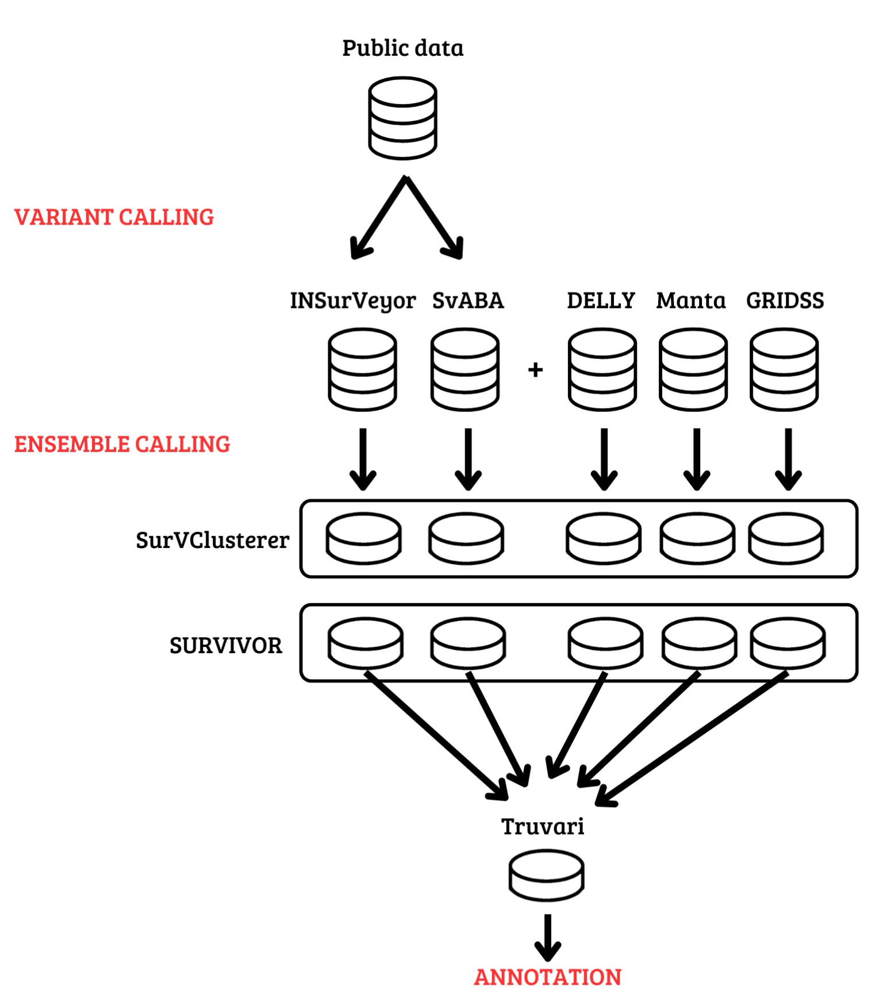

# Ensemble_calling_cnv
Workflow for variant and ensemble calling.

## Getting Started

This pipeline is written with the Nextflow system and uses [INSurVeyor](https://github.com/kensung-lab/INSurVeyor), [SvABA](https://github.com/walaj/svaba), [SurVClusterer](https://github.com/Mesh89/SurVClusterer), [SURVIVOR](https://github.com/fritzsedlazeck/SURVIVOR) and [Truvari](https://github.com/ACEnglish/truvari) as tools.

### Configuration
In the nextflow.congfig file there are some parameters to set:

    params {
        genome = //path to the reference genome
        input = //path to the directory with BAM and BAI files
        directories = [] //list of paths to the directories with .VCF.GZ and .VCF.GZ.TBI files named differently
        samples = "*" //string with represents a common pattern for bam files, for example "*.bam*"
        ensamples = "*" //string with represents a common pattern for bam files, for example "*.vcf*"
        [...]

It's important that files from "directories" doesn't have the same name because of Survivor.

Also, in the parameter field memory quantity should be set, for example '24GB':

        [...]
        ins_mem = 'NGB'     //memory for INSurVeyor
        sva_mem = 'NGB'     //memory for SvABA
        clu_mem = 'NGB'     //memory for SurVClusterer
        sur_mem = 'NGB'     //memory for SURVIVOR
        tru_mem = 'NGB'     //memory for Truvari
        }

In the nexflow.config file you should add environment variables and execution profiles. For example:

    env {
        LIBRARY_PATH = "path/to/the/library"
    }

    profiles {
        slurm {
            executor.name = 'slurm'
            queue = 'batch'
        }
    }

## Usage
A new directory should be created to store all the publishDirs and the Nextflow work directory:

    mkdir nextflow_running
    cd nextflow_running

After changing current working directory, the command to run this pipeline is:

    nextflow run ../Nextflow_cnv_script.nf -profile slurm

Nextflow allows you to resume the results already obtained after handling an error:

    nextflow run ../Nextflow_cnv_script.nf -profile slurm -resume
 

## Explanation of the processes
The workflow includes six processes, each one storing output files in a publishDir specified.  
Two channels have been created, the first gives BAM files as input to Insurveyor and Svaba. The second is used to get additional VCF files and it will be mixed with the outputs of these tow processes.  
Then Survclusterer and Survivor are executed and Truvari takes as input only the output of the second one.  
Each processes handle all index files.  

Here the principal line to show how tools are used:

### INSurVeyor
        
    insurveyor.py --threads 8 ${f[0]} ./ ${params.genome}

Where the input "f[0]" contains tuples from the channel and "params.genome" is the path to the reference genome.

### SvABA
        
    svaba run -p 24 -G ${params.genome} -t ${f[0]} -z 

Where the input "f[0]" contains tuples from the channel and "params.genome" is the path to the reference genome.

### fix_files
        
    zcat "input_file.vcf.gz" | sd "ID=GQ,Number=1,Type=String" "ID=GQ,Number=1,Type=Integer" | sd 'ID=PL,Number=[^,]*' 'ID=PL,Number=G' | bgzip > ${output} 

This process adjusts vcf outputs of Svaba to correct some errors, in particular the first "sd" changes the type of the GQ field from String to Integer and the second changes the Number value of the PL field to G. This process may need to be modified based on errors that occur if any. 

### SurVClusterer
        
    clusterer -d 1000 -t 4 file.txt ${params.genome} -o output_file.vcf

Clusterer is used with a maximum distance of 1000 base pairs between two variants, 4 threads, a file.txt, which contains the list of files to be merged, and "params.genome", that is the path to the reference genome.

### SURVIVOR
        
    SURVIVOR merge file.txt 1000 1 1 -1 -1 -1 output_file.vcf

Survivor  is used with a maximum distance of 1000 base pairs between two variants, a file.txt, which contains the list of files to be merged, and a minimum of one supporting call required for an SV, and consideration of calls that agree on the type of SV. The
strand orientation, distance estimation based on SV size, and minimum SV size are set to -1, because they are not utilized.

### Truvari
        
    truvari collapse -i bcftools.merge.vcf.gz -o truvari.vcf.gz -c output_file.vcf.gz

Truvari comes after a merging with Bcftools. It collapse all the variants.

## Visualization of the pipeline

